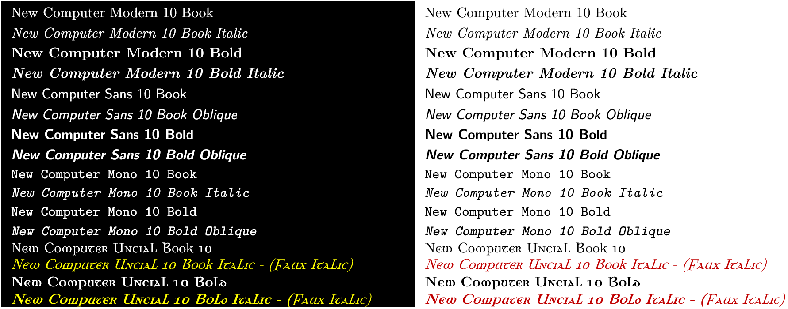

# NewCM-Radix

NewCM-Radix is a collection of the New Computer Modern font for Windows(R) and use with Radical Pie™.

## Quick Installation

If you have Windows version 10 1803 or later you can install easily with:
1. Open a Command Prompt
2. Execute the following command:
```
(if exist "%temp%\NewCMRadixInst" rmdir /s /q "%temp%\NewCMRadixInst") && md "%temp%\NewCMRadixInst" && curl -L -o "%temp%\NewCMRadixInst\main.zip" "https://github.com/nasosi/NewCM-Radix/archive/refs/heads/main.zip" && powershell -Command "Expand-Archive -Path '%temp%\NewCMRadixInst\main.zip' -DestinationPath '%temp%\NewCMRadixInst' -Force" && cd /d "%temp%\NewCMRadixInst\NewCM-Radix-main" && call Install.bat && cd /d "%temp%" && rmdir /s /q "%temp%\NewCMRadixInst"
```
## Regular Installation
1. Download the repository and extract the .zip file.
2. Inside the extracted folder, double click "Install" (or "Install.bat" depending on your configuration).
3. Delete the zip file and the folder you created.

## Brief description of the project

I began developing NewCM-Radix to make it possible to use the New Computer Modern fonts with Radical Pie™ Equation Editor and Microsoft Word. During development, I realized that the overall appearance of documents could be greatly improved by using the same typefaces for both text and equations. NewCM-Radix was created to make setting up this consistent configuration simple and straightforward

The NewCM-Radix installer performs the following actions:
1. Installs a subset of the New Computer Modern fonts into the user fonts folder: ```%localappdata%\Microsoft\Windows\Fonts```.
2. Updates the user registry such that Windows programs can recognize the fonts.
3. Installs .slug fonts for use by Radical Pie into ```%localappdata%\RadicalPie```.
4. Installs Radical Pie design files into ```%appdata%\RadicalPie\DesignFiles```.
5. Installs Word templates into the user's  ```PersonalTemplates``` templates path. You may have set this path in Word from the Menu item sequency: File->Options->Save [Default personal templates location]. If not NewCM-Radix will set it to the default.

The software comes with an an uninstaller. To uninstall execute the following in a Command Prompt:
```
%localappdata%\NewCM-Radix\Uninstall.bat
```
The uninstaller will remove all items above except the items in 4.

A demo of the Fonts supported by the project in black and white backrounds are shown below:
<div align="center">
<p align="center">
  
</p>
</div>

## Examples
Examples can be found in the [Examples folder](https://github.com/nasosi/NewCM-Radix/tree/main/Examples).

## License
The software comes with two different licenses, one for the scripts and code and one for the fonts. Please refer to the respective files and folders for details.


